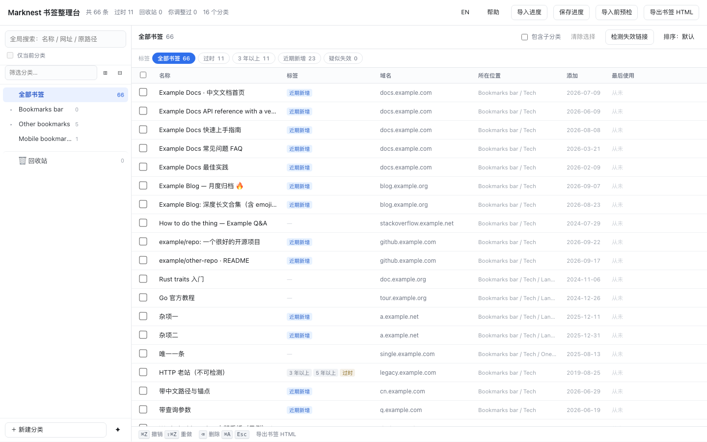

# Marknest · 浏览器书签整理台

> 一个把浏览器书签"摊开看清"再动手整理的工具：全局搜索、批量移动、删除进回收站、可撤销、
> 自动归类建议、导入前体检。所有处理都在本机完成，不上传任何数据。



**两种用法，一份源码**

| 形态 | 说明 | 适合谁 |
|---|---|---|
| **Chrome 扩展**（推荐） | 直接读写浏览器书签，改动先留在草稿里，确认后才"应用到 Chrome"，应用前自动备份 | 用 Chrome / Edge 等 Chromium 内核浏览器 |
| **单文件网页版** | 一个 `index.html`，双击即用。导入你导出的书签 HTML，整理完导出定稿再导回浏览器 | 不想装扩展、Firefox 用户、想在别的电脑上先看效果 |

## 下载

不用装 Python，直接拿构建好的：**[Releases](releases/latest)**

- `marknest-extension-vX.Y.Z.zip` — 解压得到一个文件夹，在 `chrome://extensions` 开「开发者模式」→「加载已解压的扩展程序」选它
- `marknest-web-vX.Y.Z.html` — 双击用浏览器打开，按提示导入你导出的书签 HTML

想自己构建：`python3 tools/build.py`，产物在 `dist/`；`python3 tools/package.py` 会打成上面那两个发布文件。

---

## 为什么做这个

浏览器自带的书签管理器只能一层层点开看，你没法回答"我到底有多少条书签、哪些三年没碰过、哪些站点重复收藏了几十次"。
这个工具把全部书签摊成一张可搜索、可批量操作、可撤销的表，并在你导出前做一次体检（空分类、层级过深、重复链接、命名问题等）。

## 功能

- **全局搜索**：按名称 / 网址 / 原始路径搜全部书签，结果标注它原本在哪
- **批量选择**：整列勾选热区、`⌘` 加减选、`⇧` 范围选、`⌘A` 全选、按标签一键选中筛选结果
- **书签和文件夹一起选**：混合选中后统一移动 / 删除 / 拖拽
- **拖拽**：拖到分类上移动；拖分类的上/下边缘排序，拖中间成为子分类
- **标签体系**：`常用`、`过时`、`3 年以上`、`从未访问`、`近期新增`、`疑似失效`（能力随数据源自动降级，见下）
- **回收站 + 撤销**：删除不真删；`⌘Z` 最多 200 步
- **自动归类建议**：按站点聚类 / 自定义规则表 / 结构整理（压平层级、合并碎片分类），全部可撤销
- **导入前体检**：11 项检查，带一键处理
- **失效链接检测**：可选功能，显式点击才会发起请求
- **中英双语界面**，自动跟随浏览器语言
- **进度可保存/恢复**：JSON 导出导入，换设备不丢

## 快速开始

### A. Chrome 扩展

1. `python3 tools/build.py` → 生成 `dist/extension/`
2. 打开 `chrome://extensions` → 右上角开启「开发者模式」→「加载已解压的扩展程序」→ 选 `dist/extension/`
3. 点击工具栏图标，整理台在新标签页打开，直接读取你的书签
4. 整理完点「应用到 Chrome」——会先给你看操作清单（建几个分类、移几条、删几条），确认后执行；执行前自动备份，可一键回滚

详细说明见 [docs/install-extension.md](docs/install-extension.md)。

### B. 单文件网页版

1. `python3 tools/build.py` → 生成 `dist/web/index.html`
2. 浏览器里按 `⌥⌘B`（Windows/Linux `Ctrl+Shift+O`）打开书签管理器 → 右上角 `⋮` → **导出书签**
3. 打开 `dist/web/index.html` → 选择刚才那个 HTML 文件（或点「载入演示数据」先试试）
4. 整理完点「导出书签 HTML」，再回书签管理器 `⋮` → **导入书签**

> ⚠️ 导入是**追加**：内容会进书签栏下一个新的「已导入」文件夹，不会覆盖或删掉你现有的书签。
> 确认新结构没问题后，再手动删掉旧的文件夹。详见 [docs/quickstart.md](docs/quickstart.md)。

## 数据能力差异（重要）

不同来源能拿到的字段不一样，标签会自动降级，不会假装算得出：

| 标签 | Chrome 扩展 | 网页版（导入导出的 HTML） |
|---|---|---|
| `常用` / `从未访问` | ✅ 来自浏览历史 | ❌ 导出的 HTML 里没有使用记录 |
| `过时` | 3 年前收藏 **且** 没怎么访问过 | 退化为「5 年以上未整理」 |
| `近期新增` / `3 年以上` | ✅ | ✅ |
| `疑似失效` | ✅（需授权访问网址） | ⚠️ 受跨域限制，只能判断"连不连得上" |

## 权限说明

扩展只申请三项必需权限，`history` 是唯一敏感项且可以拒绝（拒绝后只是少了「常用」标签）：

| 权限 | 用途 |
|---|---|
| `bookmarks` | 读写你的书签（这是工具的核心） |
| `storage` | 保存草稿与自动备份 |
| `history` | 计算访问频次，用于 `常用` / `从未访问` 标签 |
| `<all_urls>`（可选，按需申请） | 只有你点「检测失效链接」时才会请求 |

完整说明与隐私承诺见 [docs/privacy.md](docs/privacy.md) 和 [docs/permissions.md](docs/permissions.md)。

## 已知限制

- **Safari 不支持**：它不能导入 HTML 书签文件，只能从 Chrome/Firefox 迁移
- 自动归类**默认不动你的结构**，只给建议——把上千条书签"智能"重排这种事，任何通用规则都会猜错
- 失效检测读不到 HTTP 状态码（跨域限制），`http://` 网址会被跳过并标为「http 未测」
- 内网站点需要在能访问它的网络环境下检测，否则全部误判为失效
- 通过 HTML 导入导出的往返会重置书签的"添加时间"

## 开发与自测

```bash
python3 tools/make-demo.py     # 生成合成演示数据 samples/demo-bookmarks.html
python3 tools/build.py         # 产出 dist/extension 与 dist/web/index.html
python3 tools/package.py       # 打成发布文件（zip + 单文件 html）到 dist/release/
python3 tools/screenshot.py    # 用无头 Chrome 重新生成顶部预览图（内容全是合成数据）
python3 tests/run-tests.py     # 静态自测：构建、泄露守卫、CSP、manifest、i18n 对齐
# 功能自测：用浏览器打开 tests/browser-tests.html，应显示"全部通过"
python3 tools/leak-guard.py    # 扫描是否混入真实书签数据（发布前必跑）
python3 tools/csp-check.py     # MV3 CSP 合规：扩展包内不得有内联脚本
```

改代码后重新 `python3 tools/build.py` 即可。核心逻辑在 `src/core/`（纯函数、无浏览器依赖），
数据源在 `src/adapters/`（`chrome-adapter.js` / `file-adapter.js`），界面在 `src/ui/`。
新增一种浏览器支持只要再写一个 adapter。

欢迎 PR，但请先跑 `tests/run-tests.py` 和浏览器测试套件。

## 许可

MIT — 见 [LICENSE](LICENSE)。
